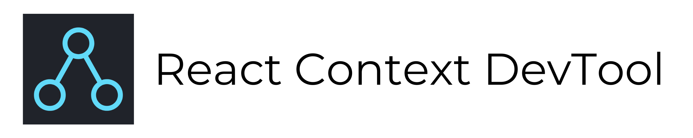

<p align="center">
  
</p>

<h2 align="center">Devtool for React Context</h2>

[](https://opensource.org/licenses/MIT)

## Installation

1. Download extension from [Chrome Web Store](https://chrome.google.com/webstore/detail/oddhnidmicpefilikhgeagedibnefkcf) or [Firefox addons store](https://addons.mozilla.org/en-US/firefox/addon/react-context-devtool/).

2. Add _REACT_CONTEXT_DEVTOOL method in your Consumer.

```js

<MyContext.Consumer>
  {
    values => {
      if (window._REACT_CONTEXT_DEVTOOL) {
        window._REACT_CONTEXT_DEVTOOL({ id: 'uniqContextId', displayName: 'Context Display Name', values });
      }
      return null;
    }
  }
</MyContext.Consumer>

```

## Use with NPM package

- Download and install npm package

```sh
npm install react-context-devtool
```

- Add ContextDevTool component inside your Provider.

```js

import ContextDevTool from 'react-context-devtool';

<MyContext.Provider value={{ a: 'hello', b: 'world' }}>
  // Add this in your context provider
  <ContextDevTool context={MyContext} id="uniqContextId" displayName="Context Display Name" />
  <YourComponent />
</MyContext.Provider>
```

## License

MIT

## Documentation managed by
<a href="https://www.editmymd.me/"></a>
